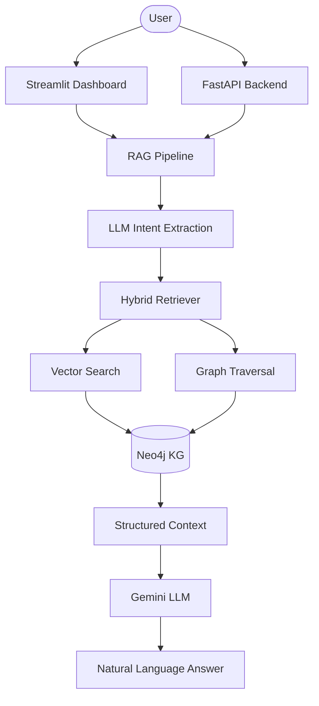

# Cloud Cost Knowledge Base & RAG Pipeline (FOCUS 1.0)

An AI-powered system designed to analyze and query mixed cloud billing data (AWS & Azure) using a Knowledge Graph (Neo4j) and RAG (Retrieval-Augmented Generation). Built strictly based on the **FOCUS 1.0 (FinOps Open Cost & Usage Specification)**.

## System Architecture



## Setup and Installation

### 1. Prerequisites
- **Neo4j Desktop**: Installed and running (local or cloud).
- **Python 3.10+**: Managed via `uv`.
- **Google Gemini API Key**: [Get it here](https://aistudio.google.com/app/apikey).

### 2. Environment Configuration
Create a `.env` file in the root directory:
```bash
NEO4J_URI=bolt://localhost:7687
NEO4J_USER=neo4j
NEO4J_PASSWORD=your_password
GOOGLE_API_KEY=your_gemini_api_key
```

### 3. Installation
```bash
# Install uv if you haven't
powershell -c "ir | iex" # Windows
# Install dependencies
uv sync
```

### 4. Database Initialization
Run the following scripts in order to build the Knowledge Graph:
```bash
# 1. Setup Constraints & Indexes
uv run python src/graph/schema.py 

# 2. Ingest Provider Data
uv run python src/graph/ingest.py 

# 3. Ingest FOCUS Metadata & Business Rules
uv run python src/graph/ingest_metadata.py 

# 4. Generate Semantic Embeddings
uv run python src/graph/embeddings.py 
```

## Ontology & Graph Design

### Design Rationale
The ontology is modeled after the **FOCUS 1.0** specification. This framework ensures that disparate billing data from AWS and Azure are mapped to a single, standardized schema. This "Common Data Model" allows cross-cloud cost comparisons without vendor-locked terminology.

### Graph Schema
- **Constraints**: Uniqueness constraints on `ResourceId`, `BillingAccountId`, `SubAccountId`, and `TimeFrameId`.
- **Indexes**: Performance indexes on `ChargePeriodStart` and `chargeCategory`.
- **Key Relationships**:
    - `(CostRecord)-[:INCURRED_BY]->(Resource)`
    - `(Resource)-[:USES_SERVICE]->(Service)`
    - `(CostRecord)-[:BELONGS_TO_SUBACCOUNT]->(SubAccount)`
    - `(CostRecord)-[:ALLOCATED_VIA]->(CostAllocation)`
    - `(CostRecord)-[:HAS_VENDOR_ATTRS]->(VendorAttributes)`

## RAG Pipeline Architecture

### 1. Query Understanding
The pipeline uses an LLM pre-processor to extract **Intent** (e.g., breakdown, comparison) and **Entities** (e.g., "S3", "Production env") from the user's natural language query.

### 2. Vector Store Design
- **Index Name**: `node_embeddings`
- **Model**: `all-MiniLM-L6-v2` (384 dimensions)
- **Coverage**: Every `Service`, `Resource`, `Charge`, and `Knowledge` (business rule) node is embedded based on its textual description.

### 3. Hybrid Retrieval
The system runs a **Vector Search** to find the most relevant "entry point" nodes, followed by a **Graph Traversal** (up to 2 levels) to fetch related entities and provenance paths.

### 4. Generation & Provenance
The LLM acts as a **FinOps Expert**. It combines the structured graph data with a persona-driven prompt to provide accurate, source-backed answers with clear cost breakdowns.

## API Documentation

| Endpoint | Method | Description |
| :--- | :--- | :--- |
| `/query` | `POST` | Input: `{"question": "..."}`. Output: answer, concepts, paths, and confidence. |
| `/health` | `GET` | returns `{"status": "ok"}`. |
| `/concept/{name}` | `GET` | Returns concept details, related nodes, and similarity scores. |
| `/stats` | `GET` | Returns total nodes, total relationships, and index status. |

## User Interfaces
- **Streamlit**: Launch via `uv run streamlit run src/app/streamlit_ui.py`.
- **FastAPI**: Launch via `uv run python src/app/api.py`.
